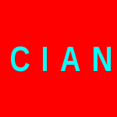

  

# cian

A VM of Cian, a minimal C-like procedural programming language. *Cian* means *C
intersection*, where there are 10 (`0xA` hexadecimally) letters between *i*
and *n*.

- Types
    + `char`, 1 byte
    + `int`, 8 bytes (backed by a `long`)
    + Pointers
    + `enum`

## License

MIT
